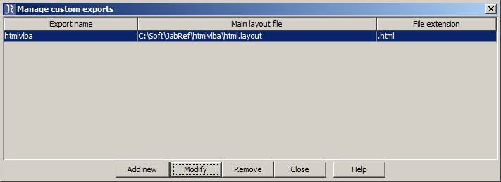
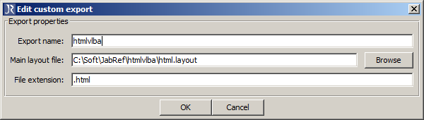

### About

Exporting BibTex database to the HTML filw with help of JabRef.

### How to use

* Download jar file of [JabRef](http://jabref.sourceforge.net/download.php)
* Configure JabRef for particular exporting template (you can refer to this list as well [JabRef - Custom export filters](http://jabref.sourceforge.net/help/CustomExports.php))
	* 
	* 
	* 
* Copy your collection of the bibtex into 'bibliography.bib'
* Configure and run 'html-vlba.bat'

### Importan Note

* In case you need an automation, you can connect html generation process with ORCID service. Use example from pyorcid library [orcid_bibtex_to_html.py](https://github.com/vdmitriyev/pyorcid/tree/master/examples) that will help you to access the ORCID and prepeare everything.
* In case of CMS TYPO3, in order to have proper HTML render, the HTML should be saved into "HTML" type page

### Dependencies

* [Java](https://www.java.com/en/download/)
* [JabRef](http://jabref.sourceforge.net/download.php)

### Materials

* [JabRef - Command line options](http://jabref.sourceforge.net/help/CommandLine.php)
* [JabRef - Custom export filters](http://jabref.sourceforge.net/help/CustomExports.php)

### Author

* Viktor Dmitriyev
